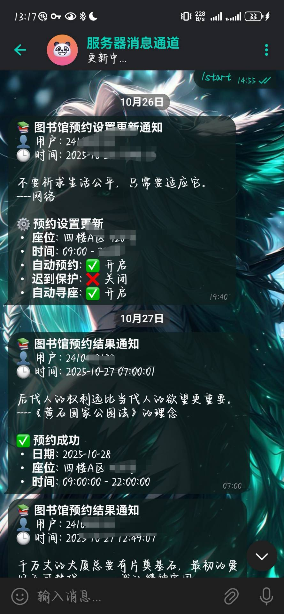

# NJFU-lib-seat-reservation

在线 Demo: <https://lib.keggin.me>

维护信息：本项目运行于日本 Azure 微软云服务器，长期续费维护，欢迎自便使用。

浏览器手机版套壳下载： <https://github.com/keggin-CHN/fuck_njfu_lib/releases/tag/mobile>

如果本项目对你有帮助，请点个 Star ⭐。(づ｡◕‿‿◕｡)づ

BUG问题可提交issue，也可联系本人: <admin@mail.keggin.me>

## ⚠️ 使用声明

**仅用于学习与技术研究，禁止用于任何商业用途。**

## 主要功能

- **自动预约**: 每日定时 (管理员 `07:00`，普通用户 `07:03`) 为用户自动预约设定的目标座位。
- **预防迟到（迟到保护）**: 在预约开始前约20分钟检测用户是否已签到。若未签到，系统将自动取消原预约，并顺延约1小时重新预约，避免用户因忘记签到而违约。
- **自动寻座**: 当目标座位在设定时段内已被占用时，若用户开启此功能，系统将自动在同一区域寻找并预约其他可用座位。
- **消息推送**: 支持企业微信、Telegram、钉钉及飞书机器人。无论是预约成功、失败，还是设置变更，系统都会实时推送详细通知。
- **实时流量监控**: 7x24小时不间断采集图书馆在馆人数（每5分钟一次），并提供可视化图表、API接口及CSV数据导出功能。
- **用户管理**: 支持多用户管理，管理员可以方便地查看和管理所有用户及其预约历史。
- **Web界面**: 提供现代化、用户友好的Web界面，包括登录、座位选择、状态查看、管理员面板等。

## 功能展示


*图1: 实时流量监控 - 系统主页会展示图书馆当前的在馆人数、占用率以及更新时间，帮助用户了解实时人流情况。*


*图2: 个性化预约设置 - 用户可以根据自己的习惯设置目标区域、座位号以及期望的预约时间段，并一键开启自动预约、迟到保护和自动寻座等功能。*

<table>
  <tr>
    <td style="padding-right:8px">
      
      <p align="center"><i>图3: 自动寻座详情 - 当目标座位被占用时，系统会列出同区域的其他可用座位供用户选择，或自动完成预约。</i></p>
    </td>
    <td style="padding-left:8px">
      
      <p align="center"><i>图4: 实时消息推送 - 预约成功后，系统会通过配置的推送渠道发送包含座位、时间等详细信息的通知。</i></p>
    </td>
  </tr>
</table>

## 部署指南

我们提供两种部署方式：一键部署脚本（推荐） 和 手动部署。

### 一键部署 (推荐)

此方法仅适用于所有基于 Debian 的 Linux 发行版 (如 Ubuntu, Debian)。请选择以下任一命令执行：

- **使用 wget:**

  ```bash
  wget -O deploy.sh https://raw.githubusercontent.com/keggin-CHN/fuck_njfu_lib/main/deploy.sh && sudo bash deploy.sh
  ```

- **使用 curl:**

  ```bash
  curl -o deploy.sh https://raw.githubusercontent.com/keggin-CHN/fuck_njfu_lib/main/deploy.sh && sudo bash deploy.sh
  ```

服务启动后，通过以下命令来管理：

- **查看状态**: `sudo systemctl status fuck_njfu_lib`
- **查看实时日志**: `sudo journalctl -u fuck_njfu_lib -f`
- **停止服务**: `sudo systemctl stop fuck_njfu_lib`
- **重启服务**: `sudo systemctl restart fuck_njfu_lib`

### 一键卸载

我们同样提供了一键卸载脚本，用于彻底清除本服务及其所有相关文件。

- **使用 wget:**

  ```bash
  wget -O uninstall.sh https://raw.githubusercontent.com/keggin-CHN/fuck_njfu_lib/main/uninstall.sh && sudo bash uninstall.sh
  ```

- **使用 curl:**

  ```bash
  curl -o uninstall.sh https://raw.githubusercontent.com/keggin-CHN/fuck_njfu_lib/main/uninstall.sh && sudo bash uninstall.sh
  ```

### 手动部署

如果您使用的是其他操作系统，或者想要更精细地控制部署过程，请遵循以下步骤。

1. **克隆项目**
   ```bash
   git clone https://github.com/keggin-CHN/fuck_njfu_lib.git
   cd fuck_njfu_lib
   ```
2. **创建虚拟环境并安装依赖**
   ```bash
   cd backend
   python3 -m venv .venv

   # Linux / macOS
   source .venv/bin/activate
   # Windows
   .venv\Scripts\activate

   pip install -r requirements.txt
   ```
3. **运行应用**
   可以通过两种方式运行后端应用：

   - **开发模式 (用于测试):**
     ```bash
     flask run --host=0.0.0.0 --port=5000
     ```
   - **生产模式 (推荐):** 使用 gunicorn 作为 WSGI 服务器来运行应用，性能更佳。
     ```bash
     gunicorn --workers 3 --bind 0.0.0.0:5000 app:app
     ```

### 访问应用

部署成功后，通过浏览器访问 `http://<您的服务器IP>:5000` 即可打开 Web 界面。

## 致谢

本项目的灵感来源与参考如下：

- <https://github.com/uglyBoy111/library-app-deploy>
- <https://github.com/kiusiudeng/NJFU-hacks>
